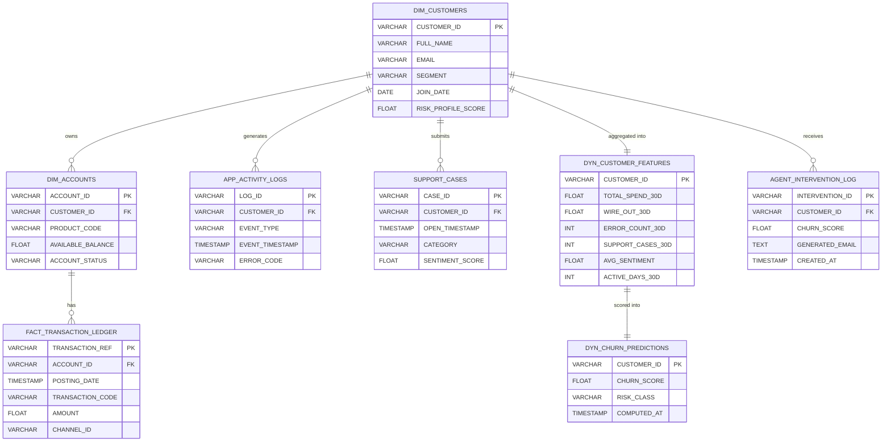
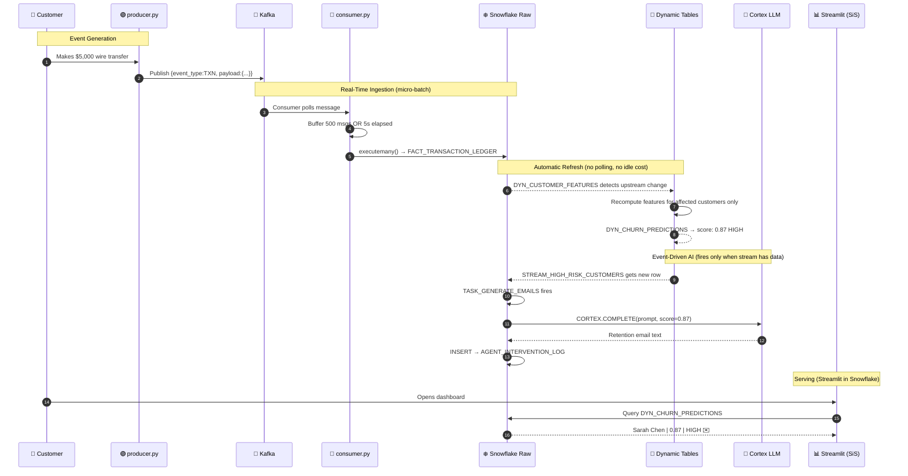
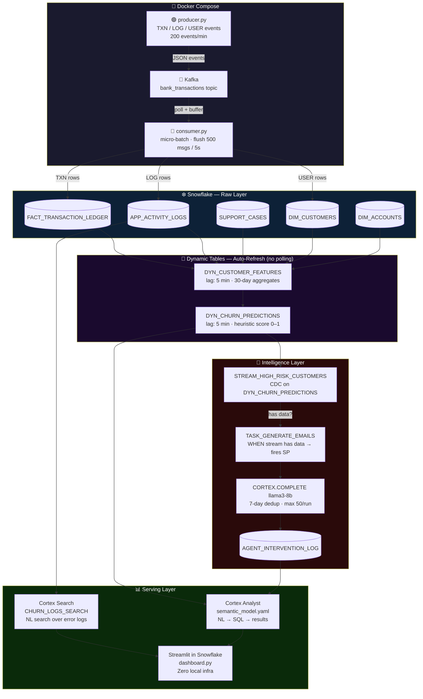

# 🏦 BankCo Churn Intelligence Platform


> A production-grade **Real-Time Customer Churn Prediction & Retention Platform**.
> Ingests live banking events via Kafka, computes churn risk automatically via Snowflake Dynamic Tables,
> and triggers personalized AI retention emails via Snowflake Cortex (llama3-8b).
> **Zero idle compute cost** — event-driven from end to end.

---

## 🏗️ Architecture



---

## Diagram A — Entity Relationship (UML)



---

## Diagram B — Sequence (Full Customer Journey)



---

## Diagram C — Event-Driven Dataflow



---

## 🛠️ Tech Stack

| Component | Technology | Role |
|---|---|---|
| **Streaming** | Apache Kafka | Ingests TXN / LOG / USER events in real-time |
| **Ingestion** | Python consumer (micro-batch) | Buffers 500 msgs / 5s → Snowflake |
| **Warehouse** | Snowflake | Central compute + storage |
| **Feature Eng.** | Dynamic Table `DYN_CUSTOMER_FEATURES` | Auto-refreshes 30-day aggregates (lag: 5 min) |
| **Scoring** | Dynamic Table `DYN_CHURN_PREDICTIONS` | Heuristic churn score, zero idle cost |
| **AI Trigger** | Snowflake Stream + Task | CDC — fires only when new HIGH-risk rows appear |
| **GenAI** | Cortex `COMPLETE` (llama3-8b) | Generates personalized retention emails |
| **Search** | Cortex Search Service | NL search over app error logs |
| **Analyst** | Cortex Analyst + semantic model | NL → SQL over churn predictions |
| **Dashboard** | Streamlit in Snowflake | 4-tab UI, zero local infra |
| **Orchestration** | Docker Compose | Kafka + producer + consumer |

---

## ⚡ Quick Start

### 1. Prerequisites
- Docker Desktop running
- Snowflake account with `BANK_WAREHOUSE` warehouse

### 2. Configure credentials
```bash
cp .env.example .env
# Edit .env with your Snowflake credentials
```

### 3. Run the pipeline
```bash
docker-compose up -d --build
```

This single command:
1. Starts Kafka + Zookeeper
2. Runs `setup.py` — drops/creates `CHURN_DEMO`, all tables, dynamic tables, stream, task, stored proc, seeds 1M+ rows
3. Runs `deploy_cortex.py` — creates Cortex Search Service + uploads semantic model
4. Starts `producer.py` — streams 200 events/min
5. Starts `consumer.py` — micro-batches into Snowflake

### 4. Deploy Streamlit Dashboard
In Snowflake UI: **Streamlit → New App → paste `src/app/dashboard.py`**

### 5. Verify
```bash
docker logs churn_setup     # Should end with ✅ SETUP COMPLETE
docker logs kafka_consumer  # Should show ✅ Flushed N rows
```

---

## 📂 Project Structure

```
proejct_proto/
├── .env.example              ← Credentials template
├── docker-compose.yml        ← Full pipeline orchestration
├── Dockerfile                ← Single image for all Python services
├── requirements.txt
├── semantic_model.yaml       ← Cortex Analyst definition
├── diagrams/
│   └── architecture.svg      ← Animated event-driven dataflow
├── scripts/
│   ├── setup.py              ← DB + tables + dynamic tables + proc + task + seed
│   └── deploy_cortex.py      ← Stage + semantic model + Cortex Search
├── streaming/
│   ├── producer.py           ← Kafka event generator (retry loop)
│   └── consumer.py           ← Kafka → Snowflake (micro-batch, retry loop)
└── src/
    ├── core/config.py        ← Snowflake credentials from env vars
    └── app/dashboard.py      ← Streamlit in Snowflake (4 tabs)
```

---

## 🧠 Key Engineering Decisions

| Decision | Rationale |
|---|---|
| **Dynamic Tables over Proc+Task** | Snowflake manages refresh DAG automatically. No idle polling. Pay only for actual compute. |
| **`WHEN STREAM_HAS_DATA`** | LLM task fires only when new HIGH-risk customers appear. Zero credits on idle. |
| **Micro-batching in consumer** | Single `executemany()` per 500 msgs vs. 500 round trips. 100x fewer Snowflake API calls. |
| **7-day LLM dedup** | Same customer never receives two emails within 7 days. Controls Cortex cost. |
| **Streamlit in Snowflake** | Zero local infrastructure. Native Snowpark session. No credentials in app code. |
| **Kafka retry loop** | Producer/consumer wait for broker readiness. Eliminates Docker startup race condition. |

---

*Built for BankCo Technical Interview — Spring 2026*
