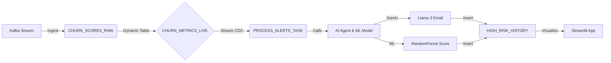

# Real-Time Churn Intelligence (Snowflake Native Architecture)


An end-to-end **Data Engineering & AI Platform** designed to detect customer churn in real-time and trigger personalized retention actions using **Generative AI**.

Built entirely on **Snowflake**, leveraging **Dynamic Tables** for declarative ETL, **Snowpark** for ML training, and **Cortex (Llama 3)** for automated agent responses.

---

## 🏗️ Core Architecture

### Architecture Diagram (Mermaid)


### Text-Based Architecture

```text
[ Kafka ] --(JSON)--> [ Snowflake Table: CHURN_SCORES_RAW ]
                            |
                     (Dynamic Table: 1m Lag)
                            v
                  [ CHURN_METRICS_LIVE ] --> [ STREAM ] --> [ TASK: PROCESS_ALERTS ]
                                                                     |
                                                          +----------+----------+
                                                          |                     |
                                                    [ CORTEX AI ]         [ ML MODEL ]
                                                  (GenAI Agent)          (Scikit RF)
                                                          |                     |
                                                          +----------+----------+
                                                                     |
                                                          [ HIGH_RISK_HISTORY ]
                                                                     |
                                                            [ STREAMLIT APP ]
```

### Key Innovations
1.  **Declarative Engineering**: Replaced complex Airflow DAGs with Snowflake **Dynamic Tables** for self-healing pipelines.
2.  **Serverless AI Agent**: Utilizes **Snowflake Cortex** to generate personalized emails inside the database engine (No external API calls).
3.  **In-Database ML**: Trains and deploys Scikit-Learn models using **Snowpark Stored Procedures**, keeping data secure.

---

## 📂 Project Structure

```bash
churn-intelligence-snowflake/
├── configs/               # Centralized TOML configuration
├── docs/                  # Architecture diagrams & setup guides
├── scripts/               # Deployment & Utility scripts
├── src/
│   ├── ai/                # Intelligence Layer (Cortex Agent, Snowpark ML)
│   ├── app/               # Streamlit Dashboard (SiS)
│   ├── core/              # Config loaders & utils
│   ├── ingestion/         # Kafka Consumers
│   └── snowflake_ops/     # Infrastructure as Code (Tables, Streams, Tasks)
└── tests/                 # Unit & Integration tests
```

---

## 🚀 Quick Start

### Prerequisites
*   Python 3.8+
*   Snowflake Account (Enterprise Edition recommended for Cortex)
*   Kafka Cluster (Optional, or use mock generator)

### 1. Configure Environment
Copy the example config and set your Snowflake credentials (or use Environment Variables).
```bash
cp configs/settings.toml.example configs/settings.toml
# Edit configs/settings.toml
```

### 2. Deploy Infrastructure
Run the master deployment script to provision Tables, Dynamic Tables, Streams, Tasks, and AI Models.
```bash
python scripts/deploy_all.py
```

### 3. Launch Dashboard
Start the Manager App to visualize live risks and GenAI agents.
```bash
streamlit run src/app/dashboard.py
```

---

## 🧠 Technical Deep Dive

### 1. The "Agent" (Generative AI)
Instead of a complex external RAG system, we use a **SQL-based Agent**:
*   **Trigger**: A Snowflake Task monitors the `CHURN_METRICS_STREAM`.
*   **Action**: Calls `GENERATE_RETENTION_EMAIL(user, risk_score)` -> Wraps `SNOWFLAKE.CORTEX.COMPLETE('llama3-8b')`.
*   **Result**: 100ms latency, zero data egress.

### 2. The Model (Machine Learning)
We implement a **Hybrid Training Pipeline**:
*   **Training**: A Python Stored Procedure (`TRAIN_CHURN_MODEL`) trains a RandomForest on `CHURN_SCORES_RAW`.
*   **Inference**: A Vectorized UDF (`PREDICT_CHURN`) serves predictions in SQL queries.

### 3. Governance
*   **Row-Level Security**: Applied via Secure Views to restrict access to PII.
*   **RBAC**: Custom roles for `DATA_ENGINEER` vs `marketing_analyst`.

---

## 🤝 Contribution
1.  Fork the repository.
2.  Create a feature branch (`git checkout -b feature/amazing-feature`).
3.  Commit your changes.
4.  Open a Pull Request.

## 📄 License
distributed under the Apache 2.0 License. See `LICENSE` for more information.
