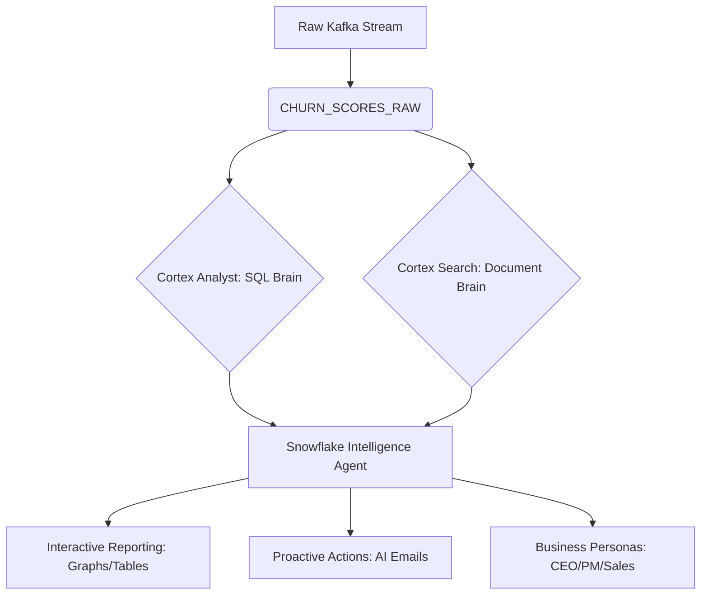

# Churn Intelligence: Autonomous Agent Implementation Plan

This document outlines the end-to-end architecture for a **Snowflake Native Intelligence Agent** designed to detect, analyze, and proactively prevent customer churn.

---

## 1. Core Architecture Overview

The system transitions from a static data pipeline to an **autonomous reasoning loop** powered by Snowflake Cortex.

---

## 2. The Semantic Brain (Cortex Analyst)

To enable Natural Language interaction, we map our structured data into a semantic layer.

| Table | Column | Logic / Synonym |
| :--- | :--- | :--- |
| `CHURN_METRICS_LIVE` | `RISK_STATUS` | "Critical", "At Risk", "Customer Health" |
| `CHURN_METRICS_LIVE` | `TOTAL_DECLINES_10M` | "Friction", "Payment Failures" |
| `HIGH_RISK_ALERTS_HISTORY` | `PREPARED_EMAIL` | "AI Draft", "Retention Strategy" |

**Interaction Pattern:**
*   *User Query:* "Show me a bar chart of users with > 5 declines."
*   *Agent Action:* Translates to SQL, executes, and renders a dynamic chart.

---

## 3. The Knowledge Brain (Cortex Search)

To move beyond just "numbers," the agent needs context from unstructured data (e.g., Support Tickets, Marketing PDF's).

1.  **CKE (Cortex Knowledge Extension)**: We index a directory of "Customer Interaction Transcripts."
2.  **Vector Search**: When a user is at risk, the Agent searches the transcripts to find **WHY**.
    *   *Result:* "User 123 is complaining about high transaction fees in their last 3 support calls."

---

## 4. The Action Engine (The Butterfly Effect)

The system remains idle (Scale-to-Zero) until triggered by data or a human.

### A. Autonomous Loop (Back-office)
1.  **Trigger**: New high-risk score arrives.
2.  **Reasoning**: Agent combines SQL data (Cortex Analyst) + Support history (Cortex Search).
3.  **Action**: Agent drafts a personalized email offering a fee waiver (GenAI).

### B. Interactive Loop (Front-office)
1.  **CEO Dashboard**: Higher-level summary of "Revenue at risk."
2.  **Sales Tool**: Interactive list of "Top 10 users to call," including a draft email ready to send.

---

## 5. Implementation Roadmap (NATIVE ONLY)

| Phase | Component | Snowflake Feature |
| :--- | :--- | :--- |
| **Phase 1** | **Incremental ELT** | Dynamic Tables (Target Lag: DOWNSTREAM) |
| **Phase 2** | **Predictive Layer** | Snowpark ML (Random Forest UDF) |
| **Phase 3** | **Semantic Modeling** | Cortex Analyst (YAML configuration) |
| **Phase 4** | **Unstructured RAG** | Cortex Search (Knowledge Base) |
| **Phase 5** | **Agent UI** | Streamlit in Snowflake (Natural Language Chat) |

---

## 6. Success Metrics (FinOps)
*   **Idle Cost**: $0.00 (Downstream Lag + Suspended Tasks).
*   **Speed to Insight**: < 100ms for GenAI draft generation.
*   **User Empowerment**: Zero SQL required for end-users (CEO/Sales).
